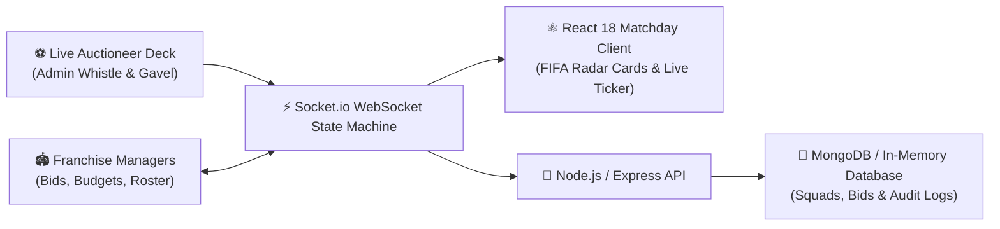

# ⚽ Kickoff Auction | Real-Time Football Player Auction & Draft System

<div align="center">

```
  ⚽ ═══════════════════════════════════════════════════════════════════ ⚽
     ██╗  ██╗██╗ ██████╗██╗  ██╗ ██████╗ ███████╗███████╗   ███████╗ ██████╗ 
     ██║ ██╔╝██║██╔════╝██║ ██╔╝██╔═══██╗██╔════╝██╔════╝   ██╔════╝██╔════╝ 
     █████╔╝ ██║██║     █████╔╝ ██║   ██║█████╗  █████╗     █████╗  ██║      
     ██╔═██╗ ██║██║     ██╔═██╗ ██║   ██║██╔══╝  ██╔══╝     ██╔══╝  ██║      
     ██║  ██╗██║╚██████╗██║  ██╗╚██████╔╝██║     ██║        ██║     ╚██████╗ 
     ╚═╝  ╚═╝╚═╝ ╚═════╝╚═╝  ╚═╝ ╚═════╝ ╚═╝     ╚═╝        ╚═╝      ╚═════╝ 
  ⚽ ═══════════════════════════════════════════════════════════════════ ⚽
```

**The Ultimate Transfer Deadline Day Experience — Real-Time Bidding Wars, EA Sports FC Tactical Radar Cards, and Stadium Acoustics.**

[](https://github.com/Manukrishna1971/Football-Player-Auction-System)
[](https://react.dev)
[](https://nodejs.org)
[](https://socket.io)
[](https://mongodb.com)
[](https://developer.mozilla.org/en-US/docs/Web/API/Web_Audio_API)
[](LICENSE)

</div>

---

## 🏟️ The Matchday Pitch Atmosphere

Step into the high-stakes pressure cooker of European football's Transfer Deadline Day. Club presidents, sporting directors, and scouts battle in real-time to construct the ultimate championship squad before the countdown timer hits zero.

```
       ═════════════════════════[ THE 4-3-3 TACTICAL PITCH ]═════════════════════════
       │                                                                             │
       │     [LW] 🏃💨                        [ST] 🎯                        [RW] ⚡     │
       │   Pace: 92+                       Clinical Finisher               Dribble: 90+      │
       │                                                                             │
       │                 [LCM] 🎩                      [RCM] 🪄                      │
       │               Vision: 89                    Playmaker: 91                   │
       │                                                                             │
       │                                   [CDM] 🛡️                                  │
       │                              The Midfield Anchor                            │
       │                                                                             │
       │     [LB] 🚀            [LCB] 🧱               [RCB] 🪨            [RB] 🏎️    │
       │  Overlapping           Rock Solid           Aerial Dominance     Speed Demon│
       │                                                                             │
       │                                   [GK] 🧤                                   │
       │                             Shot-Stopper Supremo                            │
       │                                                                             │
       ═══════════════════════════════════════════════════════════════════════════════
```

---

## 🚨 "HERE WE GO!" — Core Football Features

### 1. 🎴 EA Sports FC / FIFA Ultimate Team Holographic Cards
- **6-Attribute Polygon Radar**: Dynamic SVG hexagonal radar mapping **PAC** (Pace), **SHO** (Shooting), **PAS** (Passing), **DRI** (Dribbling), **DEF** (Defending), and **PHY** (Physical).
- **Matchday Scouting Profile**:
  - Preferred Foot (`👟 Right` / `👟 Left`)
  - Skill Moves (`★★★★★`) & Weak Foot (`★★★★☆`)
  - Work Rates (`High / Med`, `High / High`)
  - Form Rating (`🔥 Form: 8.9 / 10`)
- **Card Rarity Tiers**: Dynamic gold holographic foil borders for Marquee Superstars (OVR 88+) down to Silver Prospect gems.

### 2. ⚡ Live Auction Arena & Real-Time WebSocket Bidding
- **Synchronized 20s–25s Match Clock**: Live WebSocket countdown with urgency color shifts (Match Green ➔ Caution Amber ➔ Flashing Injury-Time Red).
- **Fox 40 Referee Whistle & Double Gavel**: Synthesized procedural audio using the **Web Audio API**—producing crisp match whistles, bidding chimes, and double-strike auctioneer gavels.
- **Romano Breaking News Ticker**: Instant `"🚨 HERE WE GO! CONFIRMED TRANSFER"` marquee alerts when a player deal is struck.
- **Financial Fair Play (FFP) Safeguards**: Real-time validation preventing clubs from bidding beyond available bank balance and enforcing squad player caps (max 11 roster spots).

### 3. 💼 Club Franchise & Budget Management
- Real-time balance deduction tracking spent cash reserves vs. liquid transfer budget.
- Automatic roster synchronization computing squad average OVR and position-fill ratios (`GK`, `DEF`, `MID`, `FWD`).

### 4. 🏆 Championship Leaderboard & Tactical Points Table
- Clubs ranked dynamically via custom football efficiency metrics:
  $$\text{Championship Points} = \sum \text{Player OVRs} + \text{Tactical Formation Balance Bonus} + \text{Remaining Budget Efficiency}$$
- Gold 👑, Silver 🥈, and Bronze 🥉 podium finishes awarded at the end of the transfer window.

---

## 🛠️ Full-Stack Football Tech Stack



- **Frontend**: React 18, Vite, Tailwind CSS, Lucide Icons, Socket.io-client, Canvas Confetti, Web Audio API Sound Synthesizer.
- **Backend**: Node.js, Express, Socket.io, Mongoose, JWT Role Protection, Multer Image Storage.
- **Database**: MongoDB with auto-detecting embedded in-memory fallback (`mongodb-memory-server`) for zero-friction instant local boot.

---

## 📂 Repository Structure

```bash
Football-Player-Auction-System/
├── backend/
│   ├── src/
│   │   ├── config/db.js          # Auto-detects local/cloud Mongo or boots in-memory DB
│   │   ├── controllers/          # Player CRUD, teams, auction state machine, analytics
│   │   ├── data/seedData.js      # Global football superstars & premier club franchises
│   │   ├── socket/auctionSocket.js # Low-latency WebSocket bidding synchronization
│   │   └── server.js             # Express & Socket.io server
│   └── package.json
├── frontend/
│   ├── src/
│   │   ├── components/
│   │   │   ├── LiveArena/        # Active FIFA card, countdown ring, bidding controls
│   │   │   ├── Players/          # FUT player cards & attribute sliders
│   │   │   ├── Teams/            # Franchise squads, balance meters & formation
│   │   │   └── Leaderboard/      # Championship points table & podium
│   │   ├── utils/
│   │   │   └── soundEffects.js   # Referee match whistle, gavel & celebration fanfare
│   │   └── App.jsx
│   └── package.json
└── README.md
```

---

## 🛠️ Kickoff — Running Locally

### 1. Clone & Setup

```bash
# Clone the repository
git clone https://github.com/Manukrishna1971/Football-Player-Auction-System.git
cd Football-Player-Auction-System
```

### 2. Boot Backend Server

```bash
cd backend
npm install
npm run dev
```
*(Runs on `http://localhost:5000` with embedded MongoDB automatically initialized)*

### 3. Launch Matchday Frontend

```bash
cd ../frontend
npm install
npm run dev
```
Open **[http://localhost:5173](http://localhost:5173)** in your browser to enter the Live Auction Arena!

---

## 📄 License

Distributed under the **MIT License**. Created by [Manukrishna](https://github.com/Manukrishna1971).
